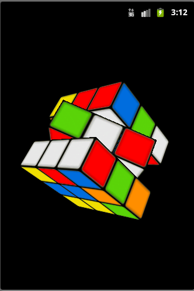

# OpenCV vs. PyOpenGL on DE10Nano
### Conclusion ###
***OpenCV vs. OpenGL***  
OpenCV is easy to use for making graphical app. On the other hand system with PyOpenGL is verry heavy to controll graphical process and DNN process with NCS asynchronous and moreover not fast.  There are no gain due to use PyOpenGL.  

- Optimization point is not clear due to be mandatory using Graphical Pipeline.
- How to finish system safety is not easy.   

### How to install ###
```
# pip3 PyOpenGL  
# apt install python-opengl  
//check
python3 -c "import OpenGL"
python3 -c "import OpenGLU"
python3 -c "import OpenGLUT"
```
### Code Example video_detector.py ###
- Rendering video stream from police_car_6095_shortened_960x540.mp4 movie file.  
- 3 threads are used, first is main thread, second is Video file Interface, last is prediction by NCS thread.
- queue and stackmax class are used to interface 2 thread.  
queue class is generally from pythone3, so supporting put() and get().  
stackmax class is having limitation of length and supporting push() and pop().

```
import sys
import time
import numpy as np
from mvnc import mvncapi as mvnc
import threading
import queue
from OpenGL.GL import *
from OpenGL.GLU import *
from OpenGL.GLUT import *
import cv2

# Queue and Stack
class maxstack:
    def __init__(self, max_stack=10):
        self._max_stack = max_stack
        self._stack = []
        self.condition = threading.Condition()
    def push(self,obj):
        with self.condition:
            if self._max_stack <= len(self._stack):
                self._stack.pop(0)
            self._stack.append(obj)
    def pop(self):
        if len(self._stack)>0:
            with self.condition:
                last = self._stack[-1]
                self._stack.pop()
                return last
        return None

class safequeue:
    def __init__(self, max_queue=128):
        self._safequeue = queue.Queue(max_queue)
    def put(self, obj):
        if not self._safequeue.full():
            self._safequeue.put(obj)
    def get(self):
        if not self._safequeue.empty():
            return self._safequeue.get()
        return None

# for movidius
labels = ('background',
          'aeroplane', 'bicycle', 'bird', 'boat',
          'bottle', 'bus', 'car', 'cat', 'chair',
          'cow', 'diningtable', 'dog', 'horse',
          'motorbike', 'person', 'pottedplant',
          'sheep', 'sofa', 'train', 'tvmonitor')
min_score_percent = 60
# the resize_window arg will modify these if its specified on the commandline
resize_output = False
resize_output_width = 0
resize_output_height = 0

#for_close_device = None
#for_close_graph  = None
movidius_thread  = None
system_stop = False

# create a preprocessed image from the source image that complies to the
# network expectations and return it
def preprocess_image(source_image):
    #resized_image = source_image
    resized_image = cv2.resize(source_image, (300, 300))
    
    # trasnform values from range 0-255 to range -1.0 - 1.0
    resized_image = resized_image - 127.5
    resized_image = resized_image * 0.007843
    return resized_image

def run_inference(image_source, ssd_mobilenet_graph, result_queue):
    # preprocess the image to meet nework expectations
    prepared_image = preprocess_image(image_source)
    # Send the image to the NCS as 16 bit floats
    ssd_mobilenet_graph.LoadTensor(prepared_image.astype(np.float16), None)
    # Get the result from the NCS
    output, _ = ssd_mobilenet_graph.GetResult()

    # Queuing for OpenGL
#    result_queue.put(output)
    return output

def init_movidius():
    global for_close_graph, for_close_device
    mvnc.SetGlobalOption(mvnc.GlobalOption.LOG_LEVEL, 2)
    devices = mvnc.EnumerateDevices()
    if len(devices) == 0:
        print('No devices found')
        quit()
    for_close_device = device = mvnc.Device(devices[0])
    device.OpenDevice()
    graph_filename = 'graph'
    with open(graph_filename, mode='rb') as f:
        graph_data = f.read()
    for_close_graph = device.AllocateGraph(graph_data)
    return for_close_graph
    #return device.AllocateGraph(graph_data)

def close_movidius():
    global for_close_graph, for_close_device
    # Clean up the graph and the device
    for_close_graph.DeallocateGraph()
    for_close_device.CloseDevice()

# For SSD_MobileNet Drawing
def overlay_on_image(source_image, object_info):
    source_image_width = source_image.shape[1]
    source_image_height = source_image.shape[0]

    base_index = 0
    class_id = object_info[base_index + 1]
    percentage = int(object_info[base_index + 2] * 100)
    if (percentage <= min_score_percent):
        return

    label_text = labels[int(class_id)] + " (" + str(percentage) + "%)"
    box_left = int(object_info[base_index + 3] * source_image_width)
    box_top = int(object_info[base_index + 4] * source_image_height)
    box_right = int(object_info[base_index + 5] * source_image_width)
    box_bottom = int(object_info[base_index + 6] * source_image_height)

    box_color = (255, 128, 0)  # box color
    box_thickness = 2
    cv2.rectangle(source_image, (box_left, box_top), (box_right, box_bottom), box_color, box_thickness)

    scale_max = (100.0 - min_score_percent)
    scaled_prob = (percentage - min_score_percent)
    scale = scaled_prob / scale_max

    # draw the classification label string just above and to the left of the rectangle
    #label_background_color = (70, 120, 70)  # greyish green background for text
    label_background_color = (0, int(scale * 175), 75)
    label_text_color = (255, 255, 255)  # white text

    label_size = cv2.getTextSize(label_text, cv2.FONT_HERSHEY_SIMPLEX, 0.5, 1)[0]
    label_left = box_left
    label_top = box_top - label_size[1]
    if (label_top < 1):
        label_top = 1
    label_right = label_left + label_size[0]
    label_bottom = label_top + label_size[1]
    cv2.rectangle(source_image, (label_left - 1, label_top - 1), (label_right + 1, label_bottom + 1),
                  label_background_color, -1)

    # label text above the box
    cv2.putText(source_image, label_text, (label_left, label_bottom), cv2.FONT_HERSHEY_SIMPLEX, 0.5, label_text_color, 1)

    # display text to let user know how to quit
    cv2.rectangle(source_image,(0, 0),(100, 15), (128, 128, 128), -1)
    cv2.putText(source_image, "Q to Quit", (10, 12), cv2.FONT_HERSHEY_SIMPLEX, 0.4, (255, 0, 0), 1)

def overlay(source_image, output):
    # number of boxes returned
    num_valid_boxes = int(output[0])

    for box_index in range(num_valid_boxes):
            base_index = 7+ box_index * 7
            if (not np.isfinite(output[base_index]) or
                    not np.isfinite(output[base_index + 1]) or
                    not np.isfinite(output[base_index + 2]) or
                    not np.isfinite(output[base_index + 3]) or
                    not np.isfinite(output[base_index + 4]) or
                    not np.isfinite(output[base_index + 5]) or
                    not np.isfinite(output[base_index + 6])):
                # boxes with non finite (inf, nan, etc) numbers must be ignored
                continue

            x1 = max(int(output[base_index + 3] * source_image.shape[0]), 0)
            y1 = max(int(output[base_index + 4] * source_image.shape[1]), 0)
            x2 = min(int(output[base_index + 5] * source_image.shape[0]), source_image.shape[0]-1)
            y2 = min((output[base_index + 6] * source_image.shape[1]), source_image.shape[1]-1)

            # overlay boxes and labels on to the image
            overlay_on_image(source_image, output[base_index:base_index + 7])

# USB camera setup
vfile = "police_car_6095_shortened_960x540.mp4"
cap = cv2.VideoCapture(vfile)
if cap.isOpened() is False:
    raise("IO Error")
cap.set(cv2.CAP_PROP_FPS, 30)
cap.set(cv2.CAP_PROP_FRAME_WIDTH, 720)
cap.set(cv2.CAP_PROP_FRAME_HEIGHT, 480)

#widowWidth = 720
widowWidth = 1028
windowHeight = 480

# Alternative detector
def run_through(image_source, ssd_mobilenet_graph, image_stack, result_queue):
    while True:
        #print("run_through")
        Image_source = image_stack.pop()
        if Image_source is None:
            time.sleep(0.080)
            result_queue.put(None)
        else:
            start = time.time()
            output = run_inference(Image_source, ssd_mobilenet_graph, result_queue)
            result_queue.put(output)
            print("%.6f FPS %d objects"%((1.0/(time.time()-start)), output[0]))
        if system_stop:
            print("stopping run_through..")
            break

# For OpenGL
def draw_image():
    ret, img = cap.read()
    if not ret:
        return

    # for Movidius
    global mostrcnt
    #imgstack.push(cv2.resize(img,(300,300)))
    imgstack.push(img)

    mostrcnt_img = img.copy()
    result = resqueue.get()
    if result is not None:
    #    print("result OK")
        mostrcnt     = result
    else:
    #    print("result None")
        pass

    if mostrcnt is None:
        # Before starting NCS
        # show with no prediction
        print("non overlay")
        pass
    else:
        # show overlayed image with current or most recent prediction
    #    print("go  overlay")
        overlay(mostrcnt_img, mostrcnt)
        pass

    # for PyOpenGL
    draw_GL(mostrcnt_img)

def init():
    glClearColor(0.7, 0.7, 0.7, 0.7)

def idle():
    glutPostRedisplay()

def reshape(w, h):
    glViewport(0, 0, w, h)
    glLoadIdentity()
    #Make the display area proportional to the size of the view
    glOrtho(-w / widowWidth, w / widowWidth, -h / windowHeight, h / windowHeight, -1.0, 1.0)

def keyboard(key, x, y):
    key = key.decode('utf-8')
    if key == 'q':
        system_stop = True
        threadlist = threading.enumerate()
        threadlist.remove(threading.main_thread())
        for th in threadlist:
            th.join()
        close_movidius()
        print('exit')
        sys.exit()

def draw_GL(img):
    img = cv2.flip(img, 0)
    img = cv2.cvtColor(img,cv2.COLOR_BGR2RGB)

    glClear(GL_COLOR_BUFFER_BIT | GL_DEPTH_BUFFER_BIT)
    glColor3f(1.0, 1.0, 1.0)

    glDrawPixels(img.shape[1], img.shape[0], GL_RGB,GL_UNSIGNED_BYTE, img)

    glFlush();
    glutSwapBuffers()

if __name__ == "__main__":

    # For OpenGL
    glutInitWindowPosition(0, 0);
    glutInitWindowSize(widowWidth, windowHeight);
    glutInit(sys.argv)
    glutInitDisplayMode(GLUT_RGBA | GLUT_DOUBLE )
    glutCreateWindow("Display")
    glutDisplayFunc(draw_image)
    glutReshapeFunc(reshape)
    glutKeyboardFunc(keyboard)
    init()
    glutIdleFunc(idle)

    # I/F OpenGL and Movidius
    imgstack = maxstack()
    resqueue = safequeue()
    mostrcnt = None

    # For Movidius
    system_stop = False
    ssd_mobilenet_graph = init_movidius()
    movidius_thread     = threading.Thread(
        target=run_through,
        args = (None, ssd_mobilenet_graph,
        imgstack,
        resqueue)
    ).start()

    glutMainLoop()
```